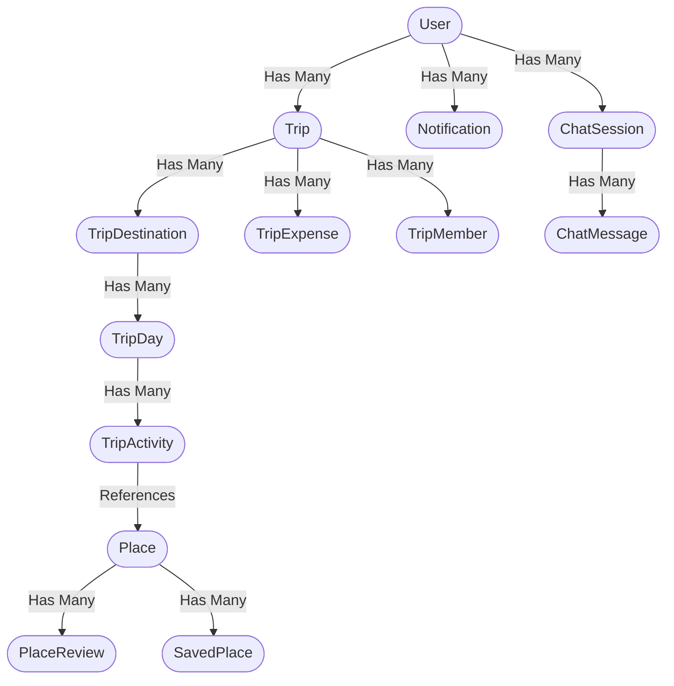

<div align="center">
  <h1>WAYNX AI Trip Planner — Backend API</h1>
  <p><strong>An intelligent, high-performance Go backend that uses Google Gemini to instantly generate perfectly validated, multi-city travel itineraries.</strong></p>

  
  
  
  
</div>

---

## Core Features

* **Autonomous AI Planning:** Leverages **Google Gemini 2.5 Flash** to autonomously construct rich, day-by-day itineraries based on user preferences (budget, age group, interests, companions).
* **Bulletproof Security:** JWT-based authentication with refresh token rotation. Passwords secured using **bcrypt (Cost 12)**.
* **Robust Relational Integrity:** GORM with strict, database-level `OnDelete:CASCADE` constraints. Hard-deleting a trip instantly wipes all associated destinations, days, and activities.
* **Leak-Proof Architecture:** All internal SQL/GORM errors are scrubbed at the service layer. Clients only see safe, generic HTTP errors.
* **AI Output Sanitization:** Custom Markdown-stripper pipeline to robustly parse AI-generated JSON, preventing crashes from hallucinated formatting.
* **Trip Collaboration:** Invite members to trips with role-based permissions (owner, editor, viewer).
* **Expense Tracking:** Track itemized expenses per trip with currency and category support.
* **Place Reviews:** Community-driven 1-5 star ratings and written reviews on locations.
* **Real-time Notifications:** In-app notification system with unread counts.

---

## Architecture

### Trip Hierarchy Data Model

When a user requests a trip, the AI's JSON output is transformed into four distinct database tables within a **single ACID transaction**:



### Project Structure

```
backend/
├── cmd/
│   ├── server/main.go          # Application entry point & route registration
│   └── seed/main.go            # Database seeder
├── internal/
│   ├── config/                  # Environment & configuration
│   ├── database/                # SQLite connection & migrations
│   ├── handlers/                # HTTP handlers (controllers)
│   ├── middleware/              # Auth & error middleware
│   ├── models/                  # GORM models
│   ├── repository/              # Database access layer
│   ├── services/                # Business logic layer
│   └── utils/                   # JWT, response helpers
├── docs/                        # Swagger auto-generated docs
└── databaseFiles/               # CSV seed data
```

---

## Quick Start

### Prerequisites
* Go 1.25 or higher
* A valid **Google Gemini API Key**

### Installation

#### Option 1: Linux Users
1. **Prerequisites**: Ensure Go (1.25 or higher) and Git are installed on your system.
2. **Clone the Repository**:
   ```bash
   git clone https://github.com/Waynx-Project-Graduation/backend.git
   cd backend
   ```
3. **Configure Environment**:
   ```bash
   cp .env.example .env
   # Open .env and set GEMINI_API_KEY, JWT_SECRET, etc.
   ```
4. **Download Dependencies & Run**:
   ```bash
   # Tidy Go modules
   go mod tidy

   # Seed the database with starter places
   go run cmd/seed/main.go

   # Start the server
   go run cmd/server/main.go
   ```

#### Option 2: Windows Users (using WSL - Recommended)
Since the GORM SQLite driver uses CGO, it requires a C compiler (GCC) to compile natively on Windows. The easiest, cleanest way to run this project on Windows from scratch is using **WSL (Windows Subsystem for Linux)**:

1. **Install WSL**:
   Open **PowerShell** as Administrator and run:
   ```powershell
   wsl --install
   ```
   *Restart your computer after the installation completes.*

2. **Install Go and Git in WSL**:
   Open your WSL terminal (e.g. Ubuntu) and install Go and Git:
   ```bash
   sudo apt update
   sudo apt install golang-go git -y
   ```

3. **Clone the Repository**:
   Navigate to your home directory (or any directory like `/mnt/c/...` if you want it on your Windows C: drive) and clone:
   ```bash
   git clone https://github.com/Waynx-Project-Graduation/backend.git
   cd backend
   ```

4. **Configure Environment**:
   ```bash
   cp .env.example .env
   # Open the .env file (e.g., nano .env) and set your GEMINI_API_KEY
   ```

5. **Download Dependencies & Run**:
   ```bash
   # Tidy Go modules
   go mod tidy

   # Seed the database with starter places
   go run cmd/seed/main.go

   # Start the server
   go run cmd/server/main.go
   ```

The server boots on `http://localhost:8080`. Swagger docs available at `/swagger/index.html`.

---

## API Reference

Base URL: `/api`

### Authentication (Public)

| Method | Endpoint | Description |
|--------|----------|-------------|
| POST | `/auth/register` | Create a new account |
| POST | `/auth/login` | Authenticate and receive JWTs |
| POST | `/auth/google` | OAuth2 login with Google |
| POST | `/auth/refresh` | Exchange refresh token for new token pair |
| POST | `/auth/forgot-password` | Request a password reset token |
| POST | `/auth/reset-password` | Reset password using token |

### Authentication (Protected)

| Method | Endpoint | Description |
|--------|----------|-------------|
| GET | `/auth/me` | Get authenticated user profile |
| POST | `/auth/logout` | Logout (invalidate session) |

### User Management (Protected)

| Method | Endpoint | Description |
|--------|----------|-------------|
| PUT | `/users/profile` | Update profile (name, city, avatar) |
| PUT | `/users/preferences` | Set travel preferences |
| PUT | `/users/password` | Change password |
| PUT | `/users/avatar` | Upload avatar image |
| GET | `/users/stats` | Get profile statistics |
| GET | `/users/saved-places` | List bookmarked places |
| DELETE | `/users/account` | Delete account (soft delete) |

### Places (Public)

| Method | Endpoint | Description |
|--------|----------|-------------|
| GET | `/places` | List places with advanced filters |
| GET | `/places/popular` | Get popular places by rating |
| GET | `/places/search` | Search places by keyword |
| GET | `/places/categories` | List all categories with counts |
| GET | `/places/cities` | List all cities with counts |
| GET | `/places/trending` | Get trending search terms |
| GET | `/places/:id` | Get place details |
| GET | `/places/:id/reviews` | List reviews for a place |

**Query parameters for `GET /places`:**
- `page`, `per_page` — Pagination
- `city` or `cities[]` — Filter by city
- `category` — Filter by category
- `budget_level` — Filter by budget (low, medium, high)
- `best_season` — Filter by season
- `crowd_level` — Filter by crowd level
- `suitable_for` — Filter by suitability (family, couple, solo, friends)
- `suitable_age` — Filter by age group
- `sort_by` — Sort: `rating`, `name`, `duration_asc`, `duration_desc`
- `search` — Full-text search

### Places (Protected)

| Method | Endpoint | Description |
|--------|----------|-------------|
| POST | `/places/:id/photo` | Upload place photo |
| POST | `/places/:id/save` | Save place to favorites |
| DELETE | `/places/:id/save` | Remove place from favorites |
| GET | `/places/:id/save` | Check if place is saved |
| POST | `/places/:id/reviews` | Submit a review (1-5 rating + comment) |
| PUT | `/places/:id/reviews/:reviewId` | Update own review |
| DELETE | `/places/:id/reviews/:reviewId` | Delete own review |

### Trips (Protected)

| Method | Endpoint | Description |
|--------|----------|-------------|
| POST | `/trips` | Generate AI trip itinerary |
| GET | `/trips` | List user's trips |
| GET | `/trips/:id` | Get full trip with destinations/days/activities |
| PUT | `/trips/:id` | Update trip metadata |
| DELETE | `/trips/:id` | Delete trip (cascading) |
| POST | `/trips/:id/regenerate` | Regenerate itinerary via AI |
| POST | `/trips/:id/activities` | Add a custom activity |
| PUT | `/trips/:id/activities/:activityId` | Update an activity |
| DELETE | `/trips/:id/activities/:activityId` | Delete an activity |

### Trip Expenses (Protected)

| Method | Endpoint | Description |
|--------|----------|-------------|
| POST | `/trips/:id/expenses` | Add an expense |
| GET | `/trips/:id/expenses` | List trip expenses |
| PUT | `/trips/:id/expenses/:expenseId` | Update an expense |
| DELETE | `/trips/:id/expenses/:expenseId` | Delete an expense |

### Trip Members (Protected)

| Method | Endpoint | Description |
|--------|----------|-------------|
| POST | `/trips/:id/members` | Invite a member by email |
| GET | `/trips/:id/members` | List trip members |
| PUT | `/trips/:id/members/:userId` | Change member role (editor/viewer) |
| DELETE | `/trips/:id/members/:userId` | Remove a member |

### Chat — WAYNX AI Assistant (Protected)

| Method | Endpoint | Description |
|--------|----------|-------------|
| POST | `/chat` | Send message, get AI response |
| GET | `/chat/history` | List chat sessions |
| GET | `/chat/:id` | Get session with messages |
| PUT | `/chat/:id` | Rename a chat session |
| DELETE | `/chat/:id` | Delete a chat session |

### Notifications (Protected)

| Method | Endpoint | Description |
|--------|----------|-------------|
| GET | `/notifications` | List notifications (paginated) |
| GET | `/notifications/unread-count` | Get unread notification count |
| PUT | `/notifications/:id/read` | Mark notification as read |
| PUT | `/notifications/read-all` | Mark all as read |

---

## The AI Pipeline

1. **Prompt Engineering:** The backend translates user JSON preferences into a highly-constrained natural language prompt.
2. **Schema Enforcement:** The AI is instructed to return data matching a strict Go struct schema.
3. **Sanitization:** The raw string is stripped of markdown wrappers and parsed via `json.Unmarshal`.
4. **Transactional Insert:** GORM opens an SQLite transaction, inserting Trip, Destinations, Days, and Activities atomically.
5. **Rollback Safety:** If any insert fails, the entire trip is rolled back, preventing partial data pollution.

---

## Environment Variables

| Variable | Description | Default |
|----------|-------------|---------|
| `PORT` | Server port | `8080` |
| `GIN_MODE` | Gin mode (debug/release) | `debug` |
| `DB_PATH` | SQLite database file path | `./kemit.db` |
| `JWT_SECRET` | JWT signing secret | `dev-secret` |
| `JWT_EXPIRY` | Access token TTL | `24h` |
| `JWT_REFRESH_EXPIRY` | Refresh token TTL | `168h` |
| `GEMINI_API_KEY` | Google Gemini API key | — |
| `AI_TIMEOUT_SECONDS` | AI request timeout | `30` |
| `WAYNX_API_URL` | WAYNX recommendation API | `https://waynx-api-production.up.railway.app` |
| `GOOGLE_CLIENT_ID` | Google OAuth client ID | — |
| `GOOGLE_CLIENT_SECRET` | Google OAuth client secret | — |
| `CLOUDINARY_URL` | Cloudinary upload URL | — |

---

## Tech Stack

- **Language:** Go 1.25
- **Framework:** Gin
- **Database:** SQLite via GORM
- **AI:** Google Gemini (generative-ai-go)
- **Auth:** JWT (golang-jwt/jwt/v5) + bcrypt
- **Image Upload:** Cloudinary
- **Docs:** Swagger (swaggo/gin-swagger)
