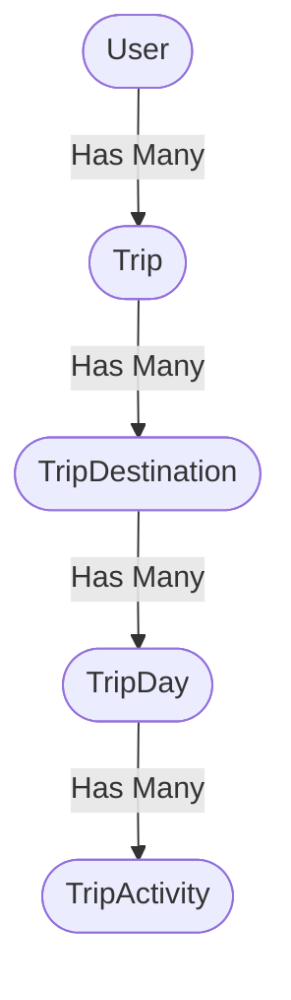

<div align="center">
  <h1>🌍 WAYNX AI Trip Planner — Backend API</h1>
  <p><strong>An intelligent, high-performance Go backend that uses Google Gemini to instantly generate perfectly validated, multi-city travel itineraries.</strong></p>

  
  
  
  
</div>

---

## ✨ Core Features

* 🧠 **Autonomous AI Planning:** Leverages **Google Gemini 2.5 Flash** to autonomously construct rich, day-by-day itineraries based on user preferences (budget, age group, interests, companions).
* 🛡️ **Bulletproof Security:** JWT-based authentication with refresh token rotation. Passwords are mathematically secured using **bcrypt (Cost 12)** to thwart brute-force attacks.
* 📦 **Robust Relational Integrity:** Utilizes GORM with strict, database-level `OnDelete:CASCADE` constraints. Hard-deleting a trip instantly and cleanly wipes thousands of associated destinations, days, and activities without leaving orphans.
* 🛡️ **Leak-Proof Architecture:** All internal SQL and GORM errors are rigorously scrubbed at the service layer before reaching the API handlers. Clients only ever see safe, generic HTTP errors.
* 🤖 **AI Output Sanitization:** Employs a custom Markdown-stripper pipeline to robustly parse AI-generated JSON, preventing app crashes even when Gemini hallucinates markdown formatting.

---

## 🏗️ Advanced Database Schema

The backend is built around a highly normalized, deeply hierarchical data model.

### Trip Hierarchy Data Model
When a user requests a trip, the AI's JSON output is transformed into four distinct database tables within a **single ACID transaction**:



### Feature Expansion Tables
To support a massive, community-driven travel app, the database includes:
* 🤝 **`trip_members`**: A specialized junction table granting View/Edit permissions to multiple users collaborating on a single trip.
* 💰 **`trip_expenses`**: A dedicated table tracking itemized financial transactions (Amount, Currency, Category) tied to specific itineraries.
* ⭐ **`place_reviews`**: A community module allowing users to leave 1-5 star ratings and written reviews on individual locations.
* 👑 **`users.role`**: Role-Based Access Control (RBAC) foundation, distinguishing standard users from system administrators.

---

## 🚀 Quick Start Guide

### Prerequisites
* Go 1.21 or higher installed.
* A valid **Google Gemini API Key**.

### Installation

```bash
# 1. Clone the repository
git clone https://github.com/Waynx-Project-Graduation/backend.git
cd backend

# 2. Configure Environment
cp .env.example .env
# Open .env and insert your GEMINI_API_KEY and WAYNX_BASE_URL

# 3. Download Dependencies
go mod tidy

# 4. Run the automated seeder (populates DB with starter places)
go run cmd/seed/main.go

# 5. Launch the server!
go run cmd/server/main.go
```
*The server will boot up and listen on `http://localhost:8080`.*

---

## 📡 API Reference

### 🔐 Authentication
* `POST /api/auth/register` — Create a new account.
* `POST /api/auth/login` — Authenticate and receive JWTs.
* `POST /api/auth/google` — OAuth2 integration with Google.
* `POST /api/auth/refresh` — Issue a new access token using a valid refresh token.

### 👤 User Management (Protected)
* `GET /api/auth/me` — Fetch the authenticated profile.
* `PUT /api/users/profile` — Update user metadata (avatar, name, city).
* `PUT /api/users/preferences` — Set global travel preferences (budget, interests) to auto-fill future AI prompts.

### ✈️ AI Trip Generation (Protected)
* `POST /api/trips` — **(Core Engine)** Generates a full trip via Gemini based on preferences.
* `POST /api/trips/:id/regenerate` — Wipes the current itinerary and prompts the AI to rebuild it from scratch.
* `GET /api/trips/:id` — Fetches the entire 4-layer trip hierarchy in a single JSON payload.
* `DELETE /api/trips/:id` — Executes a cascading hard-delete across the database.

### 🏛️ Places & Bookmarks
* `GET /api/places` — Advanced querying engine supporting filters by `budget`, `season`, `crowd_level`, and `category`.
* `POST /api/places/:id/save` — Bookmark a place to the user's wishlist.

### 💬 Ask WAYNX (Protected)
* `POST /api/chat` — Open a direct, conversational websocket/HTTP thread with the WAYNX AI Assistant to ask specific questions about locations or itineraries.

---

## 🧠 Behind the Scenes: The AI Pipeline

1. **Prompt Engineering:** When a user requests a trip, the backend translates their JSON preferences into a massive, highly-constrained natural language prompt.
2. **Schema Enforcement:** The AI is instructed to return data matching a strict Go struct schema.
3. **Sanitization:** The raw string is captured, aggressively stripped of markdown wrappers (` ```json `), and passed to the standard library `json.Unmarshal`.
4. **Transactional Insert:** If parsing succeeds, GORM opens an SQLite transaction. It inserts the `Trip`, iterates over `Destinations`, iterates over `Days`, and iterates over `Activities`. 
5. **Rollback Safety:** If any single insert fails (e.g., due to a constraint violation), the *entire* trip is rolled back instantly, ensuring the database is never polluted with partial data.
