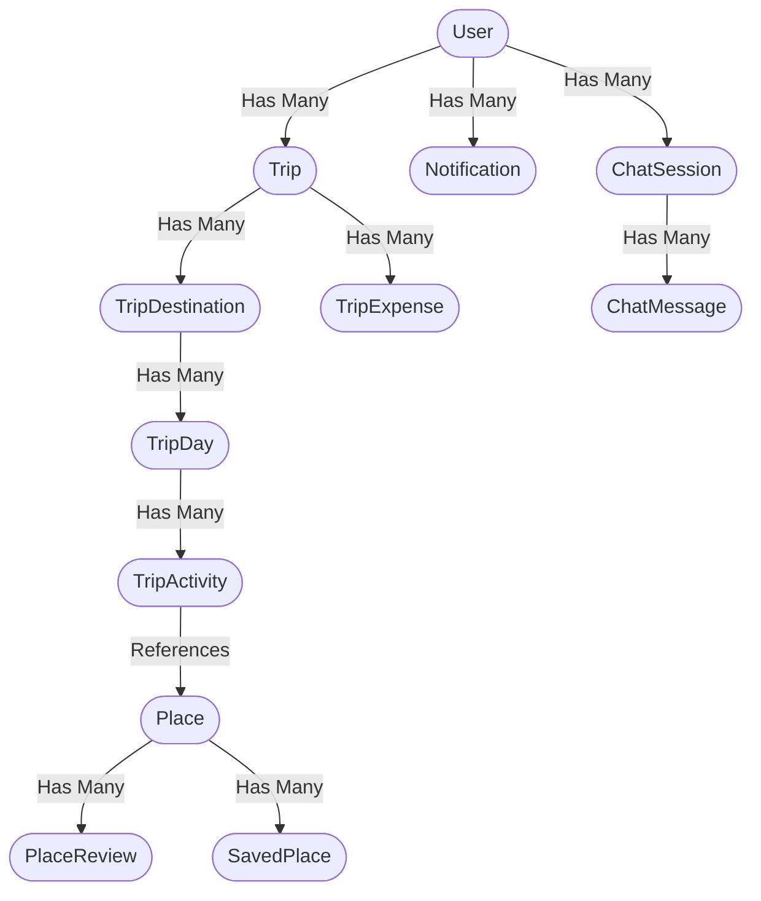

<div align="center">
  <h1>WAYNX AI Trip Planner — Backend API</h1>
  <p><strong>An intelligent, high-performance Go backend that uses Google Gemini to instantly generate perfectly validated, multi-city travel itineraries.</strong></p>

  
  
  
  
</div>

---

## Core Features

* **Autonomous AI Planning:** Leverages **Google Gemini 2.5 Flash** to autonomously construct rich, day-by-day itineraries based on user preferences (budget, age group, interests, companions).
* **Bulletproof Security:** JWT-based authentication with refresh token rotation. Passwords secured using **bcrypt (Cost 12)**.
* **Robust Relational Integrity:** GORM with strict, database-level `OnDelete:CASCADE` constraints. Hard-deleting a trip instantly wipes all associated destinations, days, and activities.
* **Leak-Proof Architecture:** All internal SQL/GORM errors are scrubbed at the service layer. Clients only see safe, generic HTTP errors.
* **Expense Tracking:** Track itemized expenses per trip with currency and category support.
* **Place Reviews:** Community-driven 1-5 star ratings and written reviews on locations.
* **Real-time Notifications:** In-app notification system with unread counts.
* **Personalized AI Chat Assistant:** A conversational WAYNX assistant that knows each user — it injects their profile, saved places and past-trip history as context, grounds answers in real database places (trustworthy `is_verified`), streams responses token-by-token over SSE, and is rate-limited per user.
* **Full User Management & Gamification:** Non-destructive partial profile/preference updates with validated enums, OAuth-aware password changes with session invalidation, guarded avatar uploads, a live explorer-points system with badge tiers, and privacy-safe account deletion that anonymizes the email for re-registration.

---

## Architecture

### Trip Hierarchy Data Model

When a user requests a trip, the AI's JSON output is transformed into four distinct database tables within a **single ACID transaction**:



### Project Structure

```
backend/
├── cmd/
│   ├── server/main.go          # Application entry point & route registration
│   └── seed/main.go            # Database seeder
├── internal/
│   ├── config/                  # Environment & configuration
│   ├── database/                # SQLite connection & migrations
│   ├── handlers/                # HTTP handlers (controllers)
│   ├── middleware/              # Auth & error middleware
│   ├── models/                  # GORM models
│   ├── repository/              # Database access layer
│   ├── services/                # Business logic layer
│   └── utils/                   # JWT, response helpers
├── docs/                        # Swagger auto-generated docs
└── databaseFiles/               # CSV seed data
```

---

## Quick Start

### Prerequisites
* Go 1.25 or higher
* A valid **Google Gemini API Key**

### Installation

#### Option 1: Linux Users
1. **Prerequisites**: Ensure Go (1.25 or higher) and Git are installed on your system.
2. **Clone the Repository**:
   ```bash
   git clone https://github.com/Waynx-Project-Graduation/backend.git
   cd backend
   ```
3. **Configure Environment**:
   ```bash
   cp .env.example .env
   # Open .env and set GEMINI_API_KEY, JWT_SECRET, etc.
   ```
4. **Download Dependencies & Run**:
   ```bash
   # Tidy Go modules
   go mod tidy

   # Seed the database with starter places
   go run cmd/seed/main.go

   # Start the server
   go run cmd/server/main.go
   ```

#### Option 2: Windows Users (using WSL - Recommended)
Since the GORM SQLite driver uses CGO, it requires a C compiler (GCC) to compile natively on Windows. The easiest, cleanest way to run this project on Windows from scratch is using **WSL (Windows Subsystem for Linux)**:

1. **Install WSL**:
   Open **PowerShell** as Administrator and run:
   ```powershell
   wsl --install
   ```
   *Restart your computer after the installation completes.*

2. **Install Go and Git in WSL**:
   Open your WSL terminal (e.g. Ubuntu) and install Go and Git:
   ```bash
   sudo apt update
   sudo apt install golang-go git -y
   ```

3. **Clone the Repository**:
   Navigate to your home directory (or any directory like `/mnt/c/...` if you want it on your Windows C: drive) and clone:
   ```bash
   git clone https://github.com/Waynx-Project-Graduation/backend.git
   cd backend
   ```

4. **Configure Environment**:
   ```bash
   cp .env.example .env
   # Open the .env file (e.g., nano .env) and set your GEMINI_API_KEY
   ```

5. **Download Dependencies & Run**:
   ```bash
   # Tidy Go modules
   go mod tidy

   # Seed the database with starter places
   go run cmd/seed/main.go

   # Start the server
   go run cmd/server/main.go
   ```

The server boots on `http://localhost:8080`. Swagger docs available at `/swagger/index.html`.

---

## API Reference

Base URL: `/api`

### Authentication (Public)

| Method | Endpoint | Description |
|--------|----------|-------------|
| POST | `/auth/register` | Create a new account |
| POST | `/auth/login` | Authenticate and receive JWTs |
| POST | `/auth/google` | OAuth2 login with Google |
| POST | `/auth/refresh` | Exchange refresh token for new token pair |
| POST | `/auth/forgot-password` | Request a password reset token |
| POST | `/auth/reset-password` | Reset password using token |

### Authentication (Protected)

| Method | Endpoint | Description |
|--------|----------|-------------|
| GET | `/auth/me` | Get authenticated user profile |
| POST | `/auth/logout` | Logout (invalidate session) |

### User Management (Protected)

Everything a signed-in user needs to manage their own account: profile, travel
preferences, password, avatar, statistics, saved places, and account deletion.
All endpoints are JWT-protected and strictly scoped to the authenticated user.

#### What this feature can do (Capabilities)

**1. View & edit profile**
- Read the full profile (`GET /users/profile`) or update name, home city and
  avatar (`PUT /users/profile`).
- **Partial, non-destructive updates:** fields use pointers under the hood —
  omitting a field leaves it unchanged, so updating your city never wipes your
  name. Sending an empty value explicitly clears an optional field.

**2. Travel preferences (feeds the AI)**
- Set interests, budget, age group, travel companion, crowd preference and
  season (`PUT /users/preferences`). These personalize both AI trip generation
  and the WAYNX chat assistant.
- **Partial updates preserved:** changing only your budget keeps the rest of your
  preferences intact (no accidental wipe).
- **Validated enums:** every field is checked against an allowed value set
  (e.g. budget ∈ low/medium/high) so invalid data can't poison the AI prompts.

**3. Secure password management**
- Change password with old-password verification and bcrypt (cost 12)
  (`PUT /users/password`).
- **OAuth-aware:** social-login accounts (Google) get a clear "not available"
  message instead of a confusing failure.
- **Session invalidation:** a successful password change bumps the account's
  token version, so refresh tokens issued to other/old sessions can no longer
  mint new tokens.

**4. Avatar upload**
- Upload an avatar image (`PUT /users/avatar`) to Cloudinary.
- **Guarded:** enforces a 5 MB size limit and validates both the content-type and
  file extension (JPEG/PNG/WebP/GIF only) — non-image files are rejected.

**5. Profile statistics & gamification**
- `GET /users/stats` returns destinations visited, AI plans created, saved-places
  count, chat-session count and explorer points.
- **Explorer points are live:** users earn points for real actions — creating a
  trip (+50), writing a review (+10), saving a place (+2) — and automatically
  climb badge tiers: `explorer → traveler → adventurer → voyager → legend`.

**6. Saved places**
- List bookmarked places with pagination (`GET /users/saved-places`).

**7. Account deletion (privacy-safe)**
- Soft-deletes the account (`DELETE /users/account`) and **anonymizes the email**
  in the same transaction, freeing the unique-email index so the person can
  re-register later. Their sessions are invalidated at the same time.

**8. Correct, honest error semantics**
- Handlers return accurate HTTP status codes: `404` for a missing user, `401` for
  a wrong current password, `400` for invalid input — instead of masking
  everything as `500`. Internal DB errors are never leaked to clients.

#### Endpoints

| Method | Endpoint | Description |
|--------|----------|-------------|
| GET | `/users/profile` | Get the authenticated user's full profile |
| PUT | `/users/profile` | Update profile (name, city, avatar) — partial, non-destructive |
| PUT | `/users/preferences` | Set travel preferences — partial, validated |
| PUT | `/users/password` | Change password (verifies old password, invalidates other sessions) |
| PUT | `/users/avatar` | Upload avatar image (type + size validated) |
| GET | `/users/stats` | Get profile statistics & explorer points |
| GET | `/users/saved-places` | List bookmarked places (paginated) |
| DELETE | `/users/account` | Delete account (soft delete + email anonymized) |

### Places (Public)

| Method | Endpoint | Description |
|--------|----------|-------------|
| POST | `/places/recommend` | Get a list of top recommended places via AI |
| GET | `/places` | List places with advanced filters |
| GET | `/places/popular` | Get popular places by rating |
| GET | `/places/search` | Search places by keyword |
| GET | `/places/categories` | List all categories with counts |
| GET | `/places/cities` | List all cities with counts |
| GET | `/places/trending` | Get trending search terms |
| GET | `/places/:id` | Get place details |
| GET | `/places/:id/reviews` | List reviews for a place |

**Query parameters for `GET /places`:**
- `page`, `per_page` — Pagination
- `city` or `cities[]` — Filter by city
- `category` — Filter by category
- `budget_level` — Filter by budget (low, medium, high)
- `best_season` — Filter by season
- `crowd_level` — Filter by crowd level
- `suitable_for` — Filter by suitability (family, couple, solo, friends)
- `suitable_age` — Filter by age group
- `sort_by` — Sort: `rating`, `name`, `duration_asc`, `duration_desc`
- `search` — Full-text search

### Places (Protected)

| Method | Endpoint | Description |
|--------|----------|-------------|
| POST | `/places/:id/save` | Save place to favorites |
| DELETE | `/places/:id/save` | Remove place from favorites |
| GET | `/places/:id/save` | Check if place is saved |
| POST | `/places/:id/reviews` | Submit a review (1-5 rating + comment) |
| PUT | `/places/:id/reviews/:reviewId` | Update own review |
| DELETE | `/places/:id/reviews/:reviewId` | Delete own review |

### Trips (Protected)

| Method | Endpoint | Description |
|--------|----------|-------------|
| POST | `/trips` | Generate AI trip itinerary |
| GET | `/trips` | List user's trips |
| GET | `/trips/:id` | Get full trip with destinations/days/activities |
| PUT | `/trips/:id` | Update trip metadata |
| DELETE | `/trips/:id` | Delete trip (cascading) |
| POST | `/trips/:id/regenerate` | Regenerate itinerary via AI |

### Trip Expenses (Protected)

| Method | Endpoint | Description |
|--------|----------|-------------|
| POST | `/trips/:id/expenses` | Add an expense |
| GET | `/trips/:id/expenses` | List trip expenses |
| PUT | `/trips/:id/expenses/:expenseId` | Update an expense |
| DELETE | `/trips/:id/expenses/:expenseId` | Delete an expense |

### Chat — WAYNX AI Assistant (Protected)

A personalized, retrieval-grounded conversational assistant. Every message is
enriched with the user's profile, preferences and travel history (injected as an
invisible system instruction) and grounded in real places from the database, so
recommendations are factual and tailored.

#### What this chatbot can do (Capabilities)

**1. Personalized answers ("it knows who it's talking to")**
On every message the backend silently builds a fresh profile of the logged-in
user and feeds it to the AI as a hidden system instruction (never shown in the
chat). This includes:
- **Identity & location:** name, home city (so it factors in travel distance), age group.
- **Travel preferences:** interests, budget level, usual travel companion, crowd preference, preferred season.
- **Behavioral history:** the cities they've recently traveled to (to suggest fresh experiences, not repeats) and the places they've bookmarked (a signal of taste).
- **Time awareness:** the current season, for season-appropriate suggestions.
> Result: replies feel tailored ("Since you're in Cairo and love history…") instead of generic.

**2. Factually grounded, anti-hallucination answers**
Before calling the AI, the backend searches the real places database for rows
relevant to the user's question and injects them as verified context. The AI is
instructed to recommend **only real places** and to be honest when unsure.
- The `is_verified` flag is set to `true` **only** when the answer is backed by real
  database records — it is never self-reported by the model, so the frontend can
  trust it (e.g. show a "verified" badge).

**3. Rich, actionable place references**
When the assistant mentions specific locations it returns them in
`related_places` as **fully hydrated objects** (id, name, city, category, rating,
thumbnail) — not bare IDs. The frontend can render clickable place cards directly
from the response and deep-link into the Places feature. Invalid/hallucinated IDs
are automatically dropped.

**4. Real-time streaming (typewriter effect)**
`POST /chat/stream` streams the answer token-by-token over Server-Sent Events
(SSE), so the UI shows text as it's generated instead of waiting for the full
reply. Falls back gracefully on errors.

**5. Multi-turn conversation memory**
Messages are grouped into **sessions**. The assistant remembers earlier turns in
the same session for coherent follow-ups. To keep it fast and cost-efficient, it
uses a **sliding context window** (the most recent ~20 messages) rather than
resending the entire history.

**6. Automatic & manual session titles**
A new conversation is auto-titled from the first message (and refined by an
AI-suggested title). Once a user manually renames a session, the AI stops
overwriting it (tracked via `title_auto_generated`). Active sessions bubble to the
top of the history list (sorted by last activity).

**7. Full session management (CRUD)**
Users can list their chat history, open any past session (with paginated
messages), rename sessions, and delete them. All operations are strictly
ownership-checked — a user can only ever access their own sessions.

**8. Bilingual-safe**
Titles and messages are handled with UTF-8-safe truncation, so Arabic (and any
multibyte) content is never corrupted.

**9. Cost & abuse protection**
- **Per-user rate limiting:** 20 messages/minute (with a small burst), returning `429` when exceeded — protects the Gemini API bill from runaway usage.
- **Cancellation-aware:** if the client disconnects, the in-flight AI request is cancelled instead of running (and billing) to completion.
- **Resilient:** if the AI service fails, the user gets a friendly fallback message instead of a hard error, and the conversation is preserved.

**10. Security & privacy**
- All endpoints require JWT authentication.
- User context is assembled server-side and injected as a protected system
  instruction; the model is instructed to ignore any attempt inside a user's
  message to override its rules (prompt-injection resistance).
- Sessions are scoped and isolated per user.

**11. Focused domain (guardrailed)**
The assistant is constrained to Egypt travel topics — places, trips, culture,
food, logistics, and safety — and politely declines unrelated or off-topic
requests.

#### Endpoints

| Method | Endpoint | Description |
|--------|----------|-------------|
| POST | `/chat` | Send message, get a full AI response |
| POST | `/chat/stream` | Send message, stream the AI response token-by-token (SSE) |
| GET | `/chat/history` | List chat sessions (paginated) |
| GET | `/chat/:id` | Get a session with its messages (paginated) |
| PUT | `/chat/:id` | Rename a chat session |
| DELETE | `/chat/:id` | Delete a chat session |

**Rate limiting:** `POST /chat` and `POST /chat/stream` are limited to **20
messages/minute per user** (small burst allowed) to bound AI cost. Exceeding
the limit returns `429 TOO_MANY_REQUESTS`.

**`POST /chat` request body:**
```json
{
  "session_id": "uuid-or-null",   // omit / null to start a new conversation
  "message": "Best 3 spots in Aswan for a history lover?"
}
```

**`POST /chat` response:**
```json
{
  "success": true,
  "data": {
    "session_id": "…",
    "user_message": { "id": "…", "role": "user", "content": "…" },
    "ai_response": {
      "id": "…",
      "role": "assistant",
      "content": "…",
      "is_verified": true,
      "related_places": [
        { "id": 12, "name": "Philae Temple", "city": "Aswan",
          "category": "history", "rating": 4.8, "thumbnail_url": "…" }
      ]
    }
  }
}
```

- **`is_verified`** is `true` only when the answer is grounded in real place
  records that exist in the database (never self-reported by the model).
- **`related_places`** are hydrated into full place objects (name, city, rating,
  thumbnail) — unresolved IDs are dropped.

**`POST /chat/stream`** returns `text/event-stream` with three event types:
- `chunk` — `{ "text": "partial answer…" }` (many, in order)
- `done`  — `{ "session_id": "…", "message_id": "…" }` (once, at the end)
- `error` — `{ "message": "…" }` (on failure)

**Query params for `GET /chat/history` and `GET /chat/:id`:** `page`, `per_page`.
`GET /chat/:id` returns `{ session, messages }` with pagination `meta`.

### Notifications (Protected)

| Method | Endpoint | Description |
|--------|----------|-------------|
| GET | `/notifications` | List notifications (paginated) |
| GET | `/notifications/unread-count` | Get unread notification count |
| PUT | `/notifications/:id/read` | Mark notification as read |
| PUT | `/notifications/read-all` | Mark all as read |

---

## The AI Pipeline

1. **Prompt Engineering:** The backend translates user JSON preferences into a highly-constrained natural language prompt.
2. **Schema Enforcement:** The AI is instructed to return data matching a strict Go struct schema.
3. **Sanitization:** The raw string is stripped of markdown wrappers and parsed via `json.Unmarshal`.
4. **Transactional Insert:** GORM opens an SQLite transaction, inserting Trip, Destinations, Days, and Activities atomically.
5. **Rollback Safety:** If any insert fails, the entire trip is rolled back, preventing partial data pollution.

---

## Environment Variables

| Variable | Description | Default |
|----------|-------------|---------|
| `PORT` | Server port | `8080` |
| `GIN_MODE` | Gin mode (debug/release) | `debug` |
| `DB_PATH` | SQLite database file path | `./kemit.db` |
| `JWT_SECRET` | JWT signing secret | `dev-secret` |
| `JWT_EXPIRY` | Access token TTL | `24h` |
| `JWT_REFRESH_EXPIRY` | Refresh token TTL | `168h` |
| `GEMINI_API_KEY` | Google Gemini API key | — |
| `AI_TIMEOUT_SECONDS` | AI request timeout | `30` |
| `WAYNX_API_URL` | WAYNX recommendation API | `https://waynx-api-production.up.railway.app` |
| `GOOGLE_CLIENT_ID` | Google OAuth client ID | — |
| `GOOGLE_CLIENT_SECRET` | Google OAuth client secret | — |
| `CLOUDINARY_URL` | Cloudinary upload URL | — |

---

## Tech Stack

- **Language:** Go 1.25
- **Framework:** Gin
- **Database:** SQLite via GORM
- **AI:** Google Gemini (generative-ai-go)
- **Auth:** JWT (golang-jwt/jwt/v5) + bcrypt
- **Image Upload:** Cloudinary
- **Docs:** Swagger (swaggo/gin-swagger)
